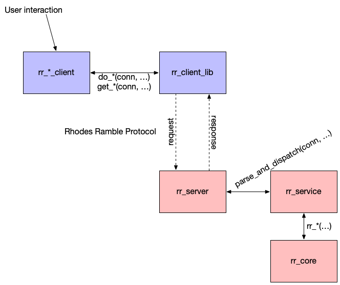

_Rhodes Ramble: Discover Your Clowder._

<a name="toc"></a>
<!--ts-->
* [Introduction](#introduction)
   * [Collaboration policy](#collaboration-policy)
* [Experimenting with Clients and Servers](#experimenting-with-clients-and-servers)
* [Yik Yak and Rhodes Ramble](#yik-yak-and-rhodes-ramble)
   * [An overly academic description of Yik Yak](#an-overly-academic-description-of-yik-yak)
   * [Rhodes Ramble](#rhodes-ramble)
* [The Rhodes Ramble protocol](#the-rhodes-ramble-protocol)
   * [Data Model](#data-model)
   * [Protocol Definition](#protocol-definition)
      * [REGISTER](#register)
         * [Request format](#request-format)
         * [Response format](#response-format)
      * [POST](#post)
         * [Request format](#request-format-1)
         * [Response format](#response-format-1)
      * [COMMENT](#comment)
         * [Request format](#request-format-2)
         * [Response format](#response-format-2)
      * [VOTE](#vote)
         * [Request format](#request-format-3)
         * [Response format](#response-format-3)
      * [USER](#user)
         * [Request format](#request-format-4)
         * [Response format](#response-format-4)
      * [POSTS](#posts)
         * [Request format](#request-format-5)
         * [Response format](#response-format-5)
      * [COMMENTS](#comments)
         * [Request format](#request-format-6)
         * [Response format](#response-format-6)
* [Project](#project)
   * [Overview of lab structure](#overview-of-lab-structure)
   * [Code organization and system architecture](#code-organization-and-system-architecture)
   * [Part 1: Implementing the Rhodes Ramble protocol](#part-1-implementing-the-rhodes-ramble-protocol)
      * [Client protocol](#client-protocol)
      * [Server protocol](#server-protocol)
      * [Testing frontend: console](#testing-frontend-console)
      * [Testing frontend: curses](#testing-frontend-curses)
   * [Part 2: Servicing concurrent clients](#part-2-servicing-concurrent-clients)
* [Tips](#tips)
* [Turning it in](#turning-it-in)

<!-- Created by https://github.com/ekalinin/github-markdown-toc -->
<!-- Added by: langm, at: Sun Apr 16 20:20:23 CDT 2023 -->

<!--te-->

# Introduction

In this lab, you'll write a clone of the "popular" [Yik Yak
app](https://yikyak.com/) using sockets and threads, _Rhodes Ramble_ (tagline:
_Discover your [Clowder](https://www.merriam-webster.com/dictionary/clowder)_).

This will involve implementing the specification of the protocol that Rhodes
Ramble clients and servers use to communicate.

This lab is broken up into three parts:

* Writing the Rhodes Ramble service protocol implementation.
* Writing the Rhodes Ramble client protocol implementation.
* Modifying the Rhodes Ramble server to be multithreaded.

The core of the business logic that implements the application has been written
for you, as well as a pair of frontend clients.

The objectives of this lab are:

* to gain experience with client/server programming using a protocol;
* to practice data parsing and manipulation;
* to use threads to provide concurrency, along with basic synchronization;
* to gain experience debugging programs with several processes and layers;
* to gain experience reading, writing, and understanding code---C in particular;
* and to gain experience reading and understanding technical documentation.

This document is broken up into three main sections:

* First, we'll provide an overview of Yik Yak and the Rhodes Ramble app.
* Next, we'll describe the specification for the Rhodes Ramble protocol.
* Finally, we'll look at the code you've been provided for this lab and discuss
  the specific pieces that you'll be required to implement.

To get started (__remember to work in a branch!__):

```
$ git clone <your-repo-url>
$ cd <cloned-repo>
$ git checkout -b <your-branch>
```

## Collaboration policy

It is fine to collaborate for this project. However, all code that you turn in
must be your own. You may not copy code directly from others or from the
internet. Copying code and renaming variables _is copying code._

You can and should talk about general problems in the lab, how to use specific
functions, etc.

__When you make your PR, note who you worked with and on what
phases/sections/functions/etc.__ If you do __not__ do this but you do work with
others, I will find it extremely suspicious if your code is similar...

🔝 [back to top](#toc)

# Experimenting with Clients and Servers

Before you get started, it might be helpful to experiment with the client and
server programs.

Reference solutions are in `/opt/share/251/bin`. To run the server, you need to
choose a port number that is not in use (choose a different value from 9999).

```
$ /opt/share/251/bin/rr_server 9999
```

Then, you can connect with a client:

```
$ /opt/share/251/bin/rr_curses_client lily.rhodes.edu 9999
$ /opt/share/251/bin/rr_console_client lily.rhodes.edu 9999
```

When you are building your own versions of these programs, you can also
experiement by running them against each other (in separate windows or using
tmux).

```
$ make
$ ./rr_server 8765
$ ./rr_curses_client lily.rhodes.edu 8765
```

There is also a class instance that is running on port 4444. Use either the
reference solution or your own solution to connect.

```
$ /opt/share/251/bin/rr_curses_client lily.rhodes.edu 4444
$ ./rr_curses_client lily.rhodes.edu 4444
```

🔝 [back to top](#toc)

# Yik Yak and Rhodes Ramble

## An overly academic description of Yik Yak

[Yik Yak](https://en.wikipedia.org/wiki/Yik_Yak) is a semi-anonymous social
media/discussion platform. The initial version of the application was quite
simple; users could do one of three actions:

* Users can create short text posts (called Yaks).
* Users can add short text comments to Yaks. 
* Comments and Yaks have an associated karma value that is changed by a user up-
  or down-voting the comment or yak.

The app is semi-anonymous in the sense that users have accounts and persistent
identities with the service, but the user account information is never displayed
to other users.

Instead, each user is assigned a random emoji. This provides a consistent
identity across posts and comments. Users can choose to change their emoji if
they would like to create a new identity. 

Users have a karma value that is the sum of the karma of all of their posts and
comments.

One of the reasons that the app is popular is that the app experience is tied to
geolocation and therefore allows for location-based communities to be formed
(e.g., at colleges). Users are only able to see and interact with content that
was posted within 5 miles of their location---though the app allows this
location to be cached so that someone traveling has access to their local Yik
Yak "community."

## Rhodes Ramble

__Rhodes Ramble__ is a clone of Yik Yak that we will implement. It is a
client-server system, where user clients post Rambles (Yaks) and comments on
Rambles to a central server.

Rhodes Ramble contains the core features of Yik Yak (semi-anonymous with a
persistent identity, posts, comments, up/down votes, and user karma) but does not
implement location-based services.

Before you get started with the lab, it might be a good idea to experiment with
the working version that is installed on lily/iris. 

In `/opt/share/251/bin/` you'll find working versions of the client and server
programs. I have a version of the server running that is available for anyone to
connect to.

```
$ /opt/share/251/bin/rr_curses_client lily.rhodes.edu 4444
```

The first program argument is the host to connect to, and the second is the
port.

You'll be greeted by asking you to login with a username and pin. Your user name
is chosen by you but not visible to other students. Your pin is your password
(__numeric only!__).

After logging, you'll be assigned an emoji and token. Your emoji can be viewed
by getting your user info. The token is an application-internal way of
identifying a user; it is a shared secret between your client program and the
server.

> __Note:__ Token-based authentication is a common practice. In this model, a
> client authenticates with a server by providing credentials (e.g., user name
> and password). The server validates these credentials and then generates,
> saves, and replies to the client with a unique token. This token is simply a
> value (e.g., in our case, a 32-bit int) that is unique to the client and
> issued by the server. When the client wants to make subsequent requests to the
> server, they provide their token as proof of their identity.

> __Warning:__ There is __zero__ security in this lab. All messages exchanged
> are plaintext, tokens are simply random numbers, etc. This is __not__ a secure
> service and you should __not__ use a pin that has anything to do with any
> other account you own.

🔝 [back to top](#toc)

# The Rhodes Ramble protocol

The Rhodes Ramble app supports a handful of operations:

* __Login:__ This allows a user to register or login. Every time a user logs in,
  their icon is changed and they are granted a new _token_.
* __Post:__ A user creates a ramble.
* __Comment:__ A user creates a comment.
* __Vote:__ A user up/down votes a comment or ramble.
* __Get Posts:__ Retrieve a list of all rambles.
* __Get Comments:__ Retrieve a list of all comments for a particular ramble.
* __Get User Info:__ Get information about a user.

These are the only operations supported.

## Data Model

The internal data model of Rhodes Ramble has two entities:

* __User:__ A user of the service. Users have a name and a pin (numeric
  password), a current emoji, a karma value, and a current token. The name and
  pin are fixed for the lifetime of the user. When the user logs in for the
  first time, their name and initial pin are immutable and fixed. The user's
  emoji and token is changed every time the user logs in. The user's karma is
  the sum of all of their rambles (over all time).

  The internal user data model is defined `users.h` and implemented in `users.c`.

* __Post/Comment:__ A ramble/post and a comment are the same entity, internally. Posts
  have an id, an emoji, text, and a parent post. Once a post is created, it is
  immutable. Rambles/posts have a NULL parent, while comments have a parent post
  that they belong to. The parent is a post id.

  The internal post data model is defined in `posts.h` and implemented in
  `posts.c`.

## Protocol Definition

When a Rhodes Ramble client connects to the Rhodes Ramble server, the server
waits for and responds to client requests.

A client request consist of a single line of text terminated with a newline
character.

The server responds to a client request with one or more lines of text,
depending on the request type.

---

### REGISTER

The register request is how a user authenticates to receive a token (and update
their emoji).

#### Request format

```
REGISTER name pin\n
```

* `name` and `pin` should be the user's name and pin. 
* `pin` must be an unsigned int printed in base 10.

#### Response format

On success, the server replies with:

```
ok token\n
```

* `token` is an unsigned int printed in base 10.

On error, the server replies with:

```
error registering pin 0\n
```

---

### POST

Users create rambles with `POST` requests.

#### Request format

```
POST token text\n
```

* `token` is the user's token.
* `text` is a string with the new ramble's text.

#### Response format

On success, the server replies with:

```
ok post_id\n
```

* `post_id` is the id of the newly-created ramble (unsigned int printed in base
  10).

On error, the server replies with:

```
error creating post 0\n
```

---

### COMMENT

Users create comments on rambles with `COMMENT` requests.

#### Request format

```
COMMENT token post_id text\n
```

* `token` is the user's token.
* `post_id` is the id of the ramble the comment is for.
* `text` is a string with the new comment's text.

#### Response format

On success, the server replies with:

```
ok comment_id\n
```

* `comment_id` is the id of the newly-created post (unsigned int printed in base
  10).

On error, the server replies with:

```
error creating post 0\n
```

---

### VOTE

Users up- or down-vote rambles or comments with `VOTE` requests.

#### Request format

```
VOTE token post_id up_down\n
```

* `token` is the user's token.
* `post_id` is the id of the comment or ramble that is being voted on.
* `up_down` is a positive or negative integer. The sign of the integer indicates
  the direction of the vote (positive = upvote, negative = downvote).

#### Response format

On success, the server replies with:

```
ok 1\n
```

On failure, the server replies with:

```
error voting 0\n
```

---

### USER

The `USER` request is used to retrieve a user's information (emoji + karma).
A user can only retrieve their own information.

#### Request format

```
USER token\n
```

* `token` is the user's valid token.

#### Response format

On success, the server replies with:

```
user emoji karma\n"
```

* `emoji` is a single `wchar_t`.
* `karma` is a signed integer representing the user's karma, printed in base 10.
  Negative karma is prefixed with `-`.

On failure, the server replies with:

```
error getting user info 0\n
```

---

### POSTS

A user retrieves all rambles from the service with a `POSTS` request. This
request and the `COMMENTS` request are the only requests where a multiline
response is provided.

#### Request format

```
POSTS token\n
```

* `token` is the user's valid token.

#### Response format

On success the server replies with a single line with an unsigned integer
representing the number of lines/posts that follow.

On successive lines, the data associated with a post is given in the following
format: `post_id karma emoji text\n`.

* `post_id` is an unsigned integer.
* `karma` is a signed integer.
* `emoji` is a single `wchar_t` value.
* `text` is the ramble/comment text.

__Example:__ In the following, the server responds with four posts.

```
4\n
1234 0 🐈 Hello fellow Lynx!\n
9999 -12 🚒 Who's throwing this weekend?\n
3210 48 🐞 Rhodes will not learn from this parking fiasco\n
6565 -4 🚒 weed?\n
```

On failure, the server responds with:

```
error retrieving posts -1
```

---

### COMMENTS

The `COMMENT` request and reply are almost the same as `POST` except the request
includes the `post_id` of the ramble to retrieve the comments for.

#### Request format

```
COMMENTS token post_id\n
```

* `token` is the user's valid token.
* `post_id` is the id of the ramble to retrieve comments for.

#### Response format

Both the success and failure responses are the same as responses to `POSTS`.

---

# Project 

In this project, you'll implement both sides (client and server) of the Rhodes
Ramble protocol.

## Overview of lab structure

```
lab5
|-- doc  ........................... images used in this document
|-- README.md  ..................... this document
`-- src
    |-- conn.h  .................... utility functions for opening/using sockets
    |-- conn.c
    |-- emojis.h  .................. emoji library
    |-- emojis.c
    |-- lib
    |   |-- map.h  ................. your old friend, the map
    |   `-- map.o  ................. my compiled map code
    |-- Makefile  .................. project Makefile
    |-- posts.h  ................... post/comment data model
    |-- posts.c
    |-- rr_client_lib.h  ........... client implementation of Rhodes Ramble protocol
    |-- rr_client_lib.c  ........... MAIN SOURCE FILE
    |-- rr_console_client.c  ....... console frontend
    |-- rr_core.h  ................. core business logic for the service
    |-- rr_core.c
    |-- rr_curses_client.c  ........ curses frontend
    |-- rr_server.c  ............... server main function / MAIN SOURCE FILE
    |-- rr_service.h  .............. service implementation of Rhodes Ramble protocol
    |-- rr_service.c  .............. MAIN SOURCE FILE
    |-- tests  
    |   |-- posts_test.c  .......... unit tests for posts
    |   |-- rr_core_test.c  ........ unit tests for service
    |   |-- test_utils.h  .......... unit testing utilities
    |   |-- test_utils.c 
    |   `-- users_test.c  .......... unit tests for users
    |-- uio.h  ..................... io utils for sockets
    |-- uio.c 
    |-- users.h  ................... user data model
    |-- users.c
    |-- util.h  .................... utility functions used in the project
    `-- util.c
```

There are a few `make` targets for the lab. You can examine the `Makefile` to
view them. If you run `make` by itself it will make all of the major targets.

## Code organization and system architecture

The Rhodes Ramble app has two processes: a _client_ and a _server_. In the
following architecture diagram, the client components are represented with blue
boxes and the server components are represented with red.

Solid arrows denote interactions via function calls, while dotted arrow
represent interactions over sockets with the Rhodes Ramble protocol.



The __client process__ is divided into two components: the frontend UI
(`rr_console_client.c` or `rr_curses_client.c`) and the _client library_
(`rr_client_lib.{h,c}`).

The UI component has two responsibilities:

* Establish the connection with the server process
* Delegate all communication with the server to the client library

The client library is responsible for implementing the Rhodes Ramble protocol.
It has a set of `do_` and `get_` functions that are used by the UI to perform
tasks (logging in, voting, commenting, posting) or retrieve data from the server
(user info, posts, comments).

> Note that the client library has its own types (`struct rr_client_post_t` and
> `struct rr_client_user_info_t`) that the UI uses to interact with it.
> 
> This added abstraction allows the UI to only be dependent upon the client
> library (and __not__ the server data model).

The __server process__ is divided into three components: the main server that
listens for incoming client connections (`rr_server.c`), the Rhodes Ramble
protocol service that parses and executes client requests (`rr_service.{h,c}`),
and the application core that actually carries out requests by modifying or
retrieving the data stored on the server (`rr_core.{h,c}`).

The server component (`rr_server.c`) should listen for connections on the port
given by `argv[1]`. When a client connects, the server should call `handle` to
handle the client connection by reading requests and providing responses in a
loop until the client disconnects.

This function calls the `parse_and_dispatch` function of the protocol service
(`rr_service.{h,c}`). The service examines the request that the client made and
determines which action to execute on the application core. It then calls the
appropriate function in the core (defined in `rr_core.h`).

When the application core has performed the action requested, the service writes
the response to the client connection.

## Part 1: Implementing the Rhodes Ramble protocol

You have been given an implementation of the core logic of the Rhodes Ramble
server. Take a look at the functions in `rr_core.h`. These functions can be used
to complete all of the client requests.

Similarly, you've been given an implementation of two frontend clients that can
be used to interact with the Rhodes Ramble service. Take a look at the
`rr_console_client.c` file; this program can be used to interact with the
service in a rudimentary way (see section [below](#testing-frontend-console).

However, the protocol implementation has _not_ been given to you. Your task for
this part of the lab is to implement both the client and server parts of the
protocol.

The `rr_server.c` file has been mostly written for you. There are a handful of
things that you need to implement to get the service listening on a socket. See
the `TODO`s in the file for details.

### Client protocol

You should implement the functions declared in `rr_client_lib.h`. These
functions should communicate with the server according to the Rhodes Ramble
protocol. You should use the `conn` file descriptor parameter and the
`uio_write`/`uio_readline` library functions.

### Server protocol

You should implement the functions declared in `rr_service.h` These functions
are used by the `rr_server.c` file to execute the service side of the Rhodes
Ramble protocol. Your function implementations should call the functions
declared in `rr_core.h`.

### Testing frontend: console

The `rr_console_client.c` file contains a command-line interface for Rhodes
Ramble. It is really not much more than a thin veneer over calling the functions
in `rr_client_lib.h` directly, and is therefore a pretty good way to exercise
your code.

```
$ ./rr_console_client lily.rhodes.edu 4444
trying to read token from /home/langm/.rr_token...
Got cached token 1102520059
Terminal UI for Rhodes Ramble
commands:
                l <name> <pin> register user with given name and pin (this is your password/id)
                g              get all messages
                u <id>         upvote message/comment with given id
                d <id>         downvote message/comment with given id
                p <text>       post message with given text
                c <id> <text>  comment on message with given id
                m <id>         get message comments for message with given id
                i              get your user info
                q              quit
                ?              print this message
> i
icon/karma: 🎀/0
> l marion 1234
got token 1967513926
token cached to /home/langm/.rr_token...
> i
icon/karma: ☕/0
> g
 1681692777 > (1) 🍛 Hello fellow Lynx!
 424238335 > (0) 📙 Rhodes will not learn from this parking fiasco
 596516649 > (0) 📹 It's such a beautiful day!
> u 596516649
> g
 1681692777 > (1) 🍛 Hello fellow Lynx!
 424238335 > (0) 📙 Rhodes will not learn from this parking fiasco
 596516649 > (1) 📹 It's such a beautiful day!
> c 596516649 right!?
> m 596516649
 1540383426 > (0) ☕ right!?
> q
```

### Testing frontend: curses

The `rr_curses_client.c` file contains a
[ncurses](https://en.wikipedia.org/wiki/Ncurses) frontend to Rhodes Ramble.
Curses is a library for building terminal UIs (TUIs) that are more interactive
and act as a substitute for GUIs in a terminal environment. 

The curses client is a lot easier to use than the `rr_console_client`, but it
does not really add any functionality.

## Part 2: Servicing concurrent clients

When you have a working server and client, you will notice that your server is
only capable of handling one client connection at a time. This means that when a
client is connected, no other client can interact with the server.

To fix this, we'll make the server multithreaded. When a client connects, you
will create a thread with `pthread_create`. This thread should handle the client
connection, allowing the main thread to continue listening for incoming
connections (and spawning new threads to handle them).

You will need to use a mutex to guard access to the application core, as the
core is __not__ threadsafe and contains race conditions. Your program can simply
guard `parse_and_dispatch` with a mutex. This approach, while inefficient and
coarse-grained, is the simplest way to implement this.

🔝 [back to top](#toc)

# Tips

* Remember that you can always run the reference programs in
  `/opt/share/251/bin`. These are good ways of testing your service and clients.

* Use `sprintf`/`snprintf` to format messages.

* You should use `uio_write` and `uio_readline` for writing to/reading from a
  socket.

* For implementing the `rr_server.c` main function, use `conn_listen` to
  allocate and bind to a socket.

* Working with multibyte character strings in C is a pain. Unicode (of which
  emoji is a part) represents characters as more than one byte, which is not the
  model that C strings use.  `wchar_t` is the "wide character" type that is used
  to represent an emoji in this lab. You shouldn't really have to deal with the
  characters that much, other than printing them to strings and parsing them
  from strings.

  * For output, you can use the `%lc` format string to print a `wchar_t` value:

    ```
    wchar_t emoji = ...;
    printf("This is an emoji: %lc\n", emoji);
    ```

  * For input, you can read `wchar_t` values from a `char` string in one of two
    ways:

    ```
    // string we'll parse
    char *my_str = "normal 🤓 chars 🔤 mixed 🍹 with 😜 emoji";

    char *emoji_start = strchr(my_str, ' ') + 1;     // points to 🤓
    wchar_t emoji_value = *(wchar_t*)emoji_start);   // treat char pointer as pointer to wide character
    char *emoji_start = strchr(my_str+1, ' ') + 1    // points to 🔤
    mbstowcs(&emoji_value, emoji_start, 1);          // decode one wide character character into emoji_value
    ```

    Of these two ways, the latter is the most robust. `man mbtowcs` for more
    information.

  If you want to read more, you can read the man page for `wchar.h`.

* Coarse-grained synchronization is sufficient from this lab. Protect all
  accesses to `rr_core` functions with a mutex.

  You can either do this in `rr_service.c`, but it is easier and fine enough to
  do this in `rr_server.c` in the thread function that handles a connection.
  Make sure that you are not holding the mutex indefinitely, but only locking it
  when you are executing the request (i.e., locking before calls to `rr_service`
  functions and unlocking afterward).

* You do not need to keep an accounting of the number of threads you create for
  connections. Though this is bad practice, it keeps this lab simpler.

* You do not need to join threads; simply call `pthread_detach` with a thread id
  to detach a thread and allow it to clean up its resources after terminating.

* The frontends cache your token so that you don't have to log in every time you
  run a frontend. This can be annoying if you are trying to test with multiple
  users.

  If you want the frontends to not cache your token, add the `-nocache` flag as
  the __last__ argument to the frontends.

🔝 [back to top](#toc)

# Turning it in

__CONGRATULATIONS!__

Like before, make a pull request!

This is a complex system with multiple interacting components. By implementing
core layers of the system, you've demonstrated that you can code to a
specification and interact with different APIs!

🔝 [back to top](#toc)
